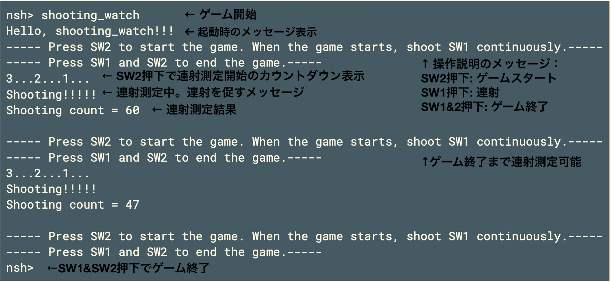
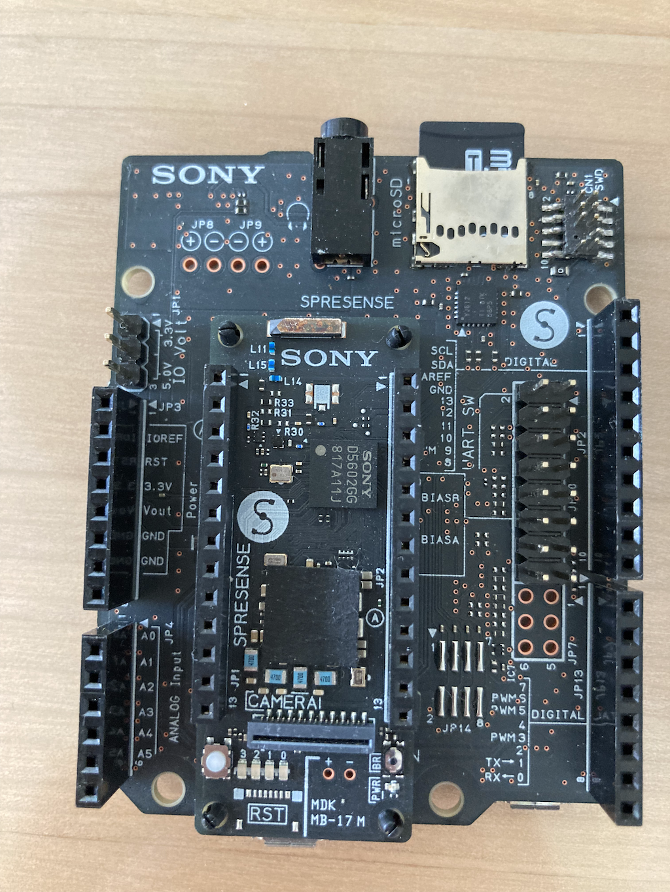
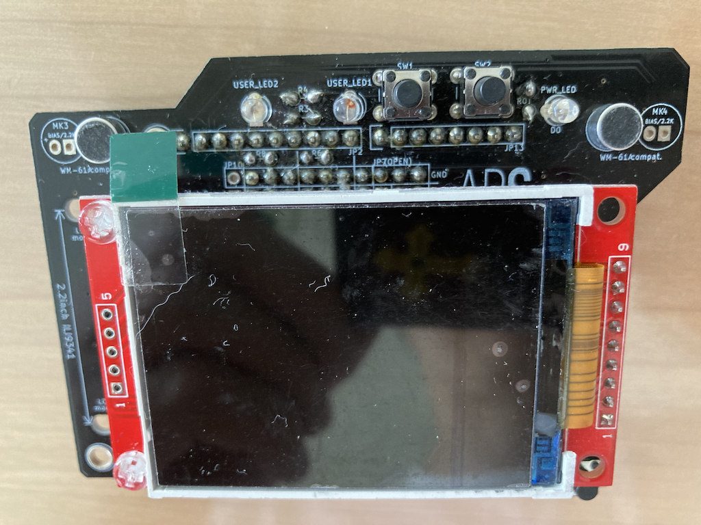
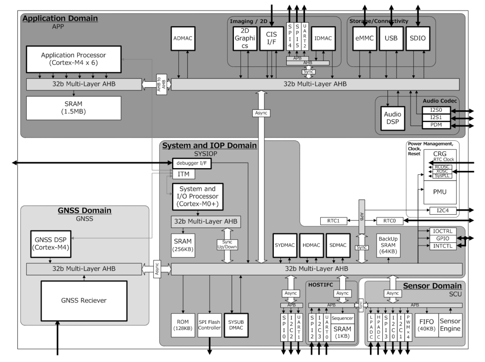
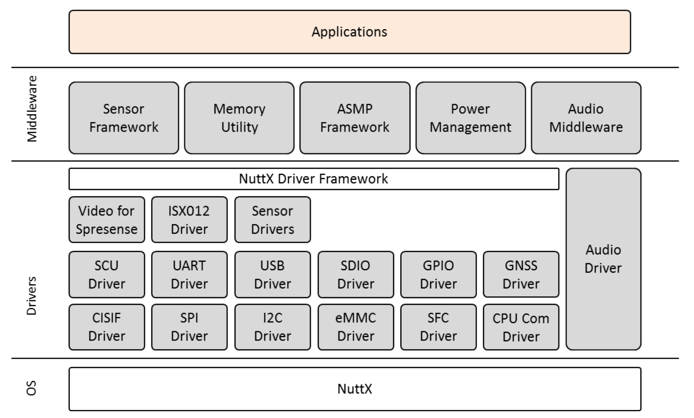
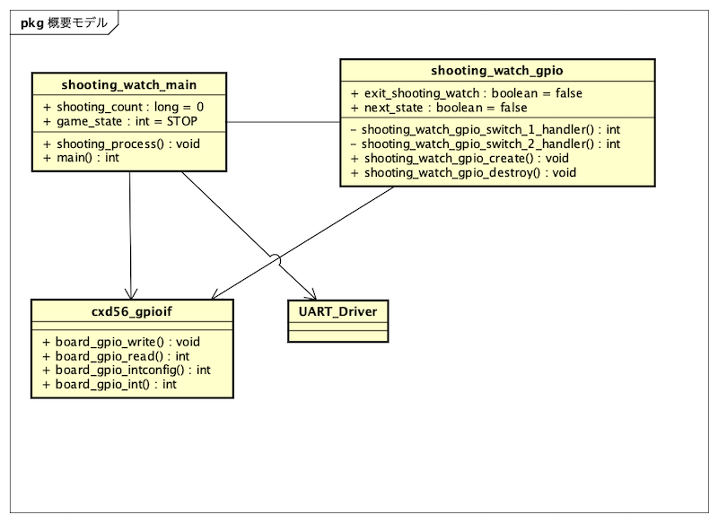

# 【連続講座】ソフトウェア設計原則【SOLID】を学ぶ
#1 単一責務の原則(single-responsibility principle)

パーソルクロステクノロジー株式会社
第1技術開発本部　第4設計部　設計2課　阿部耕二

<!--
_class: lead
_paginate: false
_header: ""
-->

# 目次
- 自己紹介
- SOLIDについて
- 単一責務の原則(single-responsibility principle)について
- 原則違反のコード例
- 原則違反のコード改善例

<!--
_header: ""
_footer: "" 
-->

# 自己紹介
- 名前: 阿部　耕二（あべ　こうじ）
- 所属: パーソルクロステクノロジー株式会社
　　第1技術開発本部 第4設計部 設計2課
- 医療機器の組込みソフトウェア開発。C言語。
- 趣味: 宇宙開発（リーマンサットプロジェクト広報メンバー）
- LAPRASポートフォリオ: https://lapras.com/public/k-abe
- twitter: @juraruming

# SOLIDについて

<!--
_footer: "" 
-->

# 単一責務の原則(single-responsibility principle)について

<!--
_footer: "" 
-->

# テーマについて
<!--
_footer: "" 
-->
趣味で開発した**連射測定ゲーム**をテーマにする。

連射測定ゲームとは???
私の少年時代の1980年後半に流行った**シュウォッチ**をマイコンボードで再現したもの。

[動画はこちら](https://www.youtube.com/shorts/THw-DGGBeK4)

## ゲーム実行画面
<!--
_footer: "" 
-->

## ゲーム環境紹介
<!--
_footer: "" 
-->
 - Spresenseメインボード
 - Spresense拡張ボード

## ゲーム環境紹介２
<!--
_footer: "" 
-->
 - APS学習ボード

## マイコン内部ブロック図
<!--
_footer: "" 
-->
 - SpresenseのプロセッサCXD5602の内部ブロック図
 [こちらから引用](https://developer.sony.com/spresense/development-guides/sdk_developer_guide_ja.html#_spresense_sdk%E3%81%AE%E6%A6%82%E8%A6%81)

## マイコン　ソフトウェアフレームワーク
<!--
_footer: "" 
-->
 - Spresense SDKの構造
 [こちらから引用](https://developer.sony.com/spresense/development-guides/introduction_ja.html#_spresense_sdk%E3%81%AE%E6%A7%8B%E9%80%A0)

# 原則違反のコード例
<!--
_footer: "" 
-->
対象コード:
https://github.com/grace2riku/spresense_game/tree/main/shooting_watch

 - shooting_watch_main.c
 - shooting_watch_gpio.c

## 概要のクラス図
<!--
_footer: "" 
-->

## 原則違反コードの改善ポイント1
<!--
_footer: "" 
-->
1. main関数にゲームロジックが集約している
 - 責務が多い
 - main関数はブート部からのエントリポイントという役割と捉える

## 原則違反コードの改善ポイント2
<!--
_footer: "" 
-->

2. shooting_watch_gpio.cはGPIOデバイスドライバーとしての役割を超えている
 - デバイスドライバーは上位からの指示でデバイス制御することで再利用しやすくなる。
 - デバイスドライバーの中に割り込みハンドラが書かれている。デバイスドライバ単体で再利用しにくい。
 デバイスドライバより上位の層に割り込みハンドラを書けるようにデバイスドライバは関数仕様を考える。

## 原則違反コードの改善ポイント3
<!--
_footer: "" 
-->

3. main関数でハードウェアアクセス関数呼び出しをしている
 - 責務を意識せず作り込みしソフトウェアの階層を無視している。
 アプリケーションは実現方法(ハードウェアの制御方法)を意識しないつくりが良い。
 アプリケーション部でハードウェアアクセスすると非常に再利用しにくいコードになる。

# 原則違反のコード改善例
<!--
_footer: "" 
-->

---

ご清聴ありがとうございました🙇