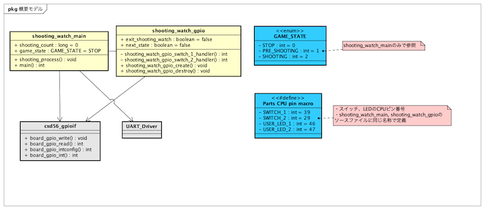

# 【連続講座】ソフトウェア設計原則【SOLID】を学ぶ
#1 単一責務の原則(single-responsibility principle)

パーソルクロステクノロジー株式会社
第1技術開発本部　第4設計部　設計2課　阿部耕二

<!--
_class: lead
_paginate: false
_header: ""
-->

# 目次
- 自己紹介
- SOLIDについて
- 単一責務の原則(single-responsibility principle)について
- テーマ説明
- 原則違反のコード例
- 原則違反のコード改善例
- 参考資料

<!--
_header: ""
_footer: "" 
-->

# 自己紹介
- 名前: 阿部　耕二（あべ　こうじ）
- 所属: パーソルクロステクノロジー株式会社
　　第1技術開発本部 第4設計部 設計2課
- 医療機器の組込みソフトウェア開発。C言語。
- 趣味: 宇宙開発（リーマンサットプロジェクト広報メンバー）
- LAPRASポートフォリオ: https://lapras.com/public/k-abe
- twitter: @juraruming

# SOLIDについて
<!--
_footer: "" 
-->
設計の5原則の頭文字をとったもの。

- S 単一責務の原則（Single Respomsibility Principle）
- O オープン・クローズドの原則（Open Closed Principle）
- L リスコフの置換原則（Liskov Substitution Principle）
- I インターフェイス分離の原則（Interface Segregation Principle）
- D 依存関係逆転の原則（Dependency Inversion Principle）

## SOLID原則の重要性
<!--
_footer: "" 
-->
> 参考資料2より引用

- 凝集度が高くなる
- 他のモジュールと疎結合になる
- 各モジュールの目的が明確に分けられると、コード変更の際の影響は局所化される。結果、テストしやすい設計になる。

上記の特徴を持つと再利用しやすいコードになる。


# 単一責務の原則(single-responsibility principle)について
<!--
_footer: "" 
-->
> 参考資料2より引用
- モジュールは単一の責務を持つようにする。
　モジュールはひとつのことだけをすべきであり、変更の理由もひとつであるべきということ。
- 単一責務の原則を適用するとモジュールの凝集度が高くなる。まとまりのあるひとつの目的を持つ関数とデータから構成されるモジュールになる。

# テーマ説明
<!--
_footer: "" 
-->
趣味で開発した**連射測定ゲーム**をテーマにする。

連射測定ゲームとは???
私の少年時代の1980年後半に流行った**シュウォッチ**をマイコンボードで再現したもの。

[動画はこちら](https://www.youtube.com/shorts/THw-DGGBeK4)


## ゲーム実行画面
<!--
_footer: "" 
-->


## ゲーム環境紹介
<!--
_footer: "" 
-->
 - Spresenseメインボード
 - Spresense拡張ボード


## ゲーム環境紹介２
<!--
_footer: "" 
-->
 - APS学習ボード


## マイコン内部ブロック図
<!--
_footer: "" 
-->
 - SpresenseのプロセッサCXD5602の内部ブロック図
 [こちらから引用](https://developer.sony.com/spresense/development-guides/sdk_developer_guide_ja.html#_spresense_sdk%E3%81%AE%E6%A6%82%E8%A6%81)


## マイコン　ソフトウェアフレームワーク
<!--
_footer: "" 
-->
 - Spresense SDKの構造
 [こちらから引用](https://developer.sony.com/spresense/development-guides/introduction_ja.html#_spresense_sdk%E3%81%AE%E6%A7%8B%E9%80%A0)


# 原則違反のコード例
<!--
_footer: "" 
-->
対象コード:
https://github.com/grace2riku/spresense_game/tree/main/shooting_watch

 - shooting_watch_main.c
 - shooting_watch_gpio.c

## 概要のクラス図
<!--
_footer: "" 
-->


## 原則違反コードの改善ポイント1
<!--
_footer: "" 
-->
1. ファイル名から責務が想像できない
 - ファイル名から処理内容が想像できたほうが良い。
 - shooting_watch_gpio.c ではGPIOを超えた上位の知識を持っている。
 LEDの名称（USER_LED1, USER_LED2）、スイッチの名称（SW1, SW2）を知っているのは上位のモジュールでよい。LED、スイッチなどのデバイスがマイコンのどのピンに接続されているか知っているのは下位のソフトウェアモジュールというのが自然。
上位は下位より抽象的な概念を扱う（下位は具体的）。
---
### 原則違反コードの改善ポイント1 ソースコード
<!--
_footer: "" 
-->
```shooting_watch_gpio.c:c
// APS学習ボードピンアサイン
#define SWITCH_1  (39)
#define SWITCH_2  (29)

void shooting_watch_gpio_create(void)
{
  /* 割り込み設定 */
  board_gpio_intconfig(SWITCH_1, INT_FALLING_EDGE,    true, shooting_watch_gpio_switch_1_handler); 
  board_gpio_intconfig(SWITCH_2, INT_FALLING_EDGE,    true, shooting_watch_gpio_switch_2_handler); 

  if (board_gpio_int(SWITCH_1, true) < 0) { 
    message("gpio_create board_gpio_int(switch_1) failure.\n");
  }

  if (board_gpio_int(SWITCH_2, true) < 0) {
    message("gpio_create board_gpio_int(switch_2) failure.\n");
  }  

  return;
}
```

## 原則違反コードの改善ポイント2
<!--
_footer: "" 
-->

2. shooting_watch_gpio.cはGPIOデバイスドライバーとしての責務を超えている
 - デバイスドライバーは上位からの指示でデバイス制御することで再利用しやすくなる。
 - デバイスドライバーの中に割り込みハンドラが書かれている。デバイスドライバ単体で再利用しにくい。割り込みハンドラにはデバイスドライバより抽象的なアプリケーションロジックを書きたいこともある。
 デバイスドライバより上位の層に割り込みハンドラを書けるようにデバイスドライバは関数仕様を考えた方が使い勝手がよさそう。

---
### 原則違反コードの改善ポイント2 ソースコード
<!--
_footer: "" 
-->
```shooting_watch_gpio.c:c
static int shooting_watch_gpio_switch_1_handler(int irq, FAR void *context, FAR void *arg)
{
  ++shooting_count;

  return 0;
}

static int shooting_watch_gpio_switch_2_handler(int irq, FAR void *context, FAR void *arg)
{
  int sw2_status = board_gpio_read(SWITCH_2);
  int sw1_status = board_gpio_read(SWITCH_1);

  if (sw1_status && !sw2_status) next_state = true;
  if (!sw1_status && !sw2_status) exit_shooting_watch = true;

  return 0;
}
```

## 原則違反コードの改善ポイント3
<!--
_footer: "" 
-->

3. main関数でハードウェアアクセス関数を呼び出している
 - 責務を意識せず作り込みしソフトウェアの階層を無視している。
 アプリケーションは実現方法(ハードウェアの具体的制御)を意識しないつくりが良い。
 アプリケーション部でハードウェアアクセスすると非常に再利用しにくいコードになる。

---
### 原則違反コードの改善ポイント3 ソースコード
<!--
_footer: "" 
-->
```shooting_watch_main.c:c
int main(int argc, FAR char *argv[])
{
  int one_time_counter = 0;
  int game_coundown; 

  shooting_watch_gpio_create();

  printf("Hello, shooting_watch!!!\n");

  while(exit_shooting_watch != true) {
    switch (game_state) {
    case STOP:
      if (one_time_counter == 0) {
        printf("----- Press SW2 to start the game. When the game starts, shoot SW1 continuously.-----\n");
        printf("----- Press SW1 and SW2 to end the game.-----\n");
        one_time_counter = 1;

        board_gpio_write(USER_LED_1, USER_LED_TURN_OFF);
        board_gpio_write(USER_LED_2, USER_LED_TURN_OFF);
      }

```


# 原則違反のコード改善例
<!--
_footer: "" 
-->


# 参考資料
<!--
_footer: "" 
-->
1. [オブジェクト指向習得のための５ステップ【SOLID原則】](https://qiita.com/taktt7/items/af90960f580373f3bb9b)

2. [テスト駆動開発による組み込みプログラミング―C言語とオブジェクト指向で学ぶアジャイルな設計](https://www.oreilly.co.jp/books/9784873116143/)


---
ご清聴ありがとうございました🙇