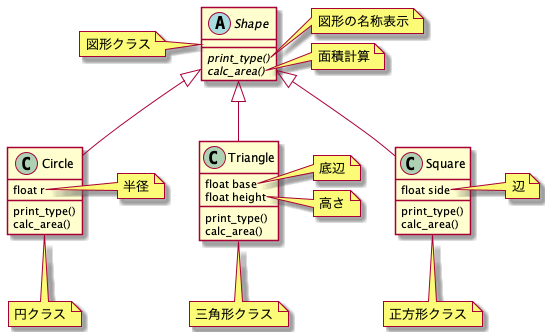

# 【連続講座】ソフトウェア設計原則【SOLID】を学ぶ
#2 インターフェイス分離の原則（Interface segregation principle）

パーソルクロステクノロジー株式会社
第1技術開発本部　第4設計部　設計2課　阿部耕二

<!--
_class: lead
_paginate: false
_header: ""
footer: ""
-->

# 目次
- 自己紹介
- SOLIDについて
- インターフェイス分離の原則（Interface segregation principle）について
- インターフェイスについて
- 例1. 複合機
- 例2. 乗り物
- 例3. read, write
- 例4. リングバッファ

---
<!--
_paginate: false
_header: ""
-->
- 今回の設計所感
- 設計についてのディスカッション・質問
- 参考資料


<!--
_header: ""
_footer: "" 
-->

# 自己紹介
- 名前: 阿部　耕二（あべ　こうじ）
- 所属: パーソルクロステクノロジー株式会社
第1技術開発本部 第4設計部 設計2課
- 医療機器の組込みソフトウェア開発。C言語。
- 趣味: 宇宙開発（リーマンサットプロジェクト広報メンバー）
- LAPRASポートフォリオ: https://lapras.com/public/k-abe
- Twitter: @juraruming

# SOLIDについて
<!--
_footer: "" 
-->
設計の5原則の頭文字をとったもの。

- S 単一責務の原則（Single Respomsibility Principle）
- O オープン・クローズドの原則（Open Closed Principle）
- L リスコフの置換原則（Liskov Substitution Principle）
- **I インターフェイス分離の原則（Interface Segregation Principle）**
- D 依存関係逆転の原則（Dependency Inversion Principle）

## SOLID原則の重要性
<!--
_footer: "" 
-->
> 参考資料2より引用

- 凝集度が高くなる
- 他のモジュールと疎結合になる
- 各モジュールの目的が明確に分けられると、コード変更の際の影響は局所化される。結果、テストしやすい設計になる。

上記の特徴を持つと再利用しやすいコードになる。


# インターフェイス分離の原則（Interface segregation principle）について
<!--
_footer: "" 
-->
- 相手に必要なことだけを見せるようにする。必要ないことを見せるとよくないことがおきる。
本来、関連が必要ないクラスと関連をもってしまったり（疎結合ではなく密結合になる）、
変更の影響が大きくなってしまったりする。

> 参考資料1より引用

# インターフェイスについて
<!--
_footer: "" 
-->
インターフェイスとは?
機能の使い方のみを定義している。
データ・処理を持たない。

データ・処理をもたないのでそのまま使うことはできない。
インターフェイスの使い方を実現したクラスをインスタンス化して使う。

インターフェイスは参考資料3が個人的にわかりやすかった。
[Interfaceクラスの使い方ポイント解説【オブジェクト指向】](https://qiita.com/taktt7/items/74981c610d8cd451d4aa)

---
<!--
_footer: "" 
-->
C++でインターフェイス実現例


```
#include <iostream>
#include <cstdlib>

class Shape {
public:
    virtual void print_type() = 0;
    virtual float calc_area() = 0;
};

class Circle : public Shape {
private:
    float r;
public:
    Circle(float r) { this->r = r;}
    ~Circle() { }
        
    void print_type() {
        std::cout << "This is circle." << std::endl;
    }
    
    float calc_area() {
        return this->r * this->r * 3.14;
    }
};

class Triangle : public Shape {
private:
    float base;
    float height;
public:
    Triangle(float base, float height) {this->base = base; this->height = height;}
    ~Triangle() { }
        
    void print_type() {
        std::cout << "This is triangle." << std::endl;
    }
    
    float calc_area() {
        return (this->base * this->height) / 2.0;
    }
};

class Square : public Shape {
private:
    float side;
public:
    Square(float side) {this->side = side;}
    ~Square() { }
        
    void print_type() {
        std::cout << "This is square." << std::endl;
    }
    
    float calc_area() {
        return this->side * this->side;
    }
};
```

---
<!--
_footer: "" 
-->
C++でインターフェイス実現例（インターフェイスを使う側）
```
int main()
{
    Shape* circle = new Circle(1.2);
    Shape* triangle = new Triangle(2.5, 2.0);
    Shape* square = new Square(1.3);

    circle->print_type();
    std::cout << "circle area = " << circle->calc_area() << std::endl;
    
    triangle->print_type();
    std::cout << "triangle area = " << triangle->calc_area() << std::endl;

    square->print_type();
    std::cout << "square area = " << square->calc_area() << std::endl;
}
```


# 例1. 複合機
<!--
_footer: "" 
-->
参考資料4の複合機の例がわかりやすかったので説明に使わせていただく。

クラス図.png)

クラス図.png)


---
<!--
_footer: "" 
-->
複合機の例の学び

* 異なる目的を持つ機能を組み合わせて製品にバリエーションを持たせる、などのときにインターフェイス分離の原則は効果を発揮しそうだ。

* 対象を自然な形で表現できる。

* インターフェイス分離の原則と単一責務の原則のエッセンスは似ている。小さい目的の組み合わせでシステムが構成する。


# 例2. 乗り物
<!--
_footer: "" 
-->
参考資料5の乗り物のアクションの例がわかりやすかったので説明に使わせていただく。

クラス.png)

クラス図.png)

---
<!--
_footer: "" 
-->
乗り物の例の学び
* インターフェイスを分離しないことで例の**車の飛ぶメソッド**のように現実とはかけ離れた構造を実現できてしまうので注意が必要。


# 例3. read, write
<!--
_footer: "" 
-->
インタフェース分離の原則で組込みソフトウェア向けのサンプルコードをChatGPTに提示してもらいました。
原則違反の例、原則に則った例のコードを提示してもらいました。

IoTの文脈でセンサーデータを読み込み、活用するシステムをイメージしてもらえればと思います。

---
<!--
_footer: "" 
-->
原則違反の例
```
class IDevice {
public:
    virtual void readData() = 0;
    virtual void writeData() = 0;
    virtual void performAction() = 0;
};

class Sensor : public IDevice {
public:
    void readData() override {
        // センサーデータを読み取る処理
    }

    void writeData() override {
        // センサーデータを保存する処理
    }

    void performAction() override {
        // センサーの動作を制御する処理
    }
};
```

---
<!--
_footer: "" 
-->
原則に則った例
```
class IDataReader {
public:
    virtual void readData() = 0;
};

class IDataWriter {
public:
    virtual void writeData() = 0;
};

class IActionPerformer {
public:
    virtual void performAction() = 0;
};

class Sensor : public IDataReader, public IDataWriter, public IActionPerformer {
public:
    void readData() override {
        // センサーデータを読み取る処理
    }

    void writeData() override {
        // センサーデータを保存する処理
    }

    void performAction() override {
        // センサーの動作を制御する処理
    }
};
```

---
<!--
_footer: "" 
-->
データの読み込み、書き込みを分けると組込みソフトウェアの現場で使いそうな汎用的なパターンになりそうです。

```
class SensorDataDispley : public IDataReader, public IActionPerformer {
public:
    void readData() override { // センサーデータを読み取る処理 }
    void performAction() override { // センサーの動作を制御する処理 }
};

class SensorDataStore : public IDataWriter {
public:
    void writeData() override { // センサーデータを保存する処理 }
};
```


# 例4. リングバッファ
<!--
_footer: "" 
-->
インタフェース分離の原則で組込みソフトウェア向けのサンプルコードを考えた時にはじめに頭に浮かんだのがリングバッファでした。
インタフェース分離とはリングバッファのライトとリードのインターフェースを分けるような実装かなぁと想像しました。

こちらもChatGPTにコードを提示してもらいました。

---
<!--
_footer: "" 
-->
原則違反の例
```
class IRingBuffer {
public:
    virtual void enqueue(int data) = 0;
    virtual int dequeue() = 0;
    virtual bool isEmpty() = 0;
};

class RingBuffer : public IRingBuffer {
private:
    int buffer[100];
    int head;
    int tail;

public:
    void enqueue(int data) override {
        // データをバッファに追加する処理
    }

    int dequeue() override {
        // バッファからデータを取り出す処理
        return 0;
    }

    bool isEmpty() override {
        // バッファが空かどうかを判定する処理
        return true;
    }
};
```

---
<!--
_footer: "" 
-->
```
class Application {
public:
    void processData(IRingBuffer* buffer) {
        if (!buffer->isEmpty()) {
            int data = buffer->dequeue();
            // データを処理する
        }
    }
};

int main() {
    RingBuffer buffer;
    Application app;

    // アプリケーションを実行
    app.processData(&buffer);

    return 0;
}
```

---
<!--
_footer: "" 
-->
原則に則った例

```
class IEnqueuer {
public:
    virtual void enqueue(int data) = 0;
};

class IDequeuer {
public:
    virtual int dequeue() = 0;
};

class IBufferChecker {
public:
    virtual bool isEmpty() = 0;
};

class RingBuffer : public IEnqueuer, public IDequeuer, public IBufferChecker {
private:
    int buffer[100];
    int head;
    int tail;

public:
    void enqueue(int data) override {
        // データをバッファに追加する処理
    }

    int dequeue() override {
        // バッファからデータを取り出す処理
        return 0;
    }

    bool isEmpty() override {
        // バッファが空かどうかを判定する処理
        return true;
    }
};
```

---
<!--
_footer: "" 
-->
```
class Application {
public:
    void processData(IDequeuer* dequeuer, IBufferChecker* checker) {
        if (!checker->isEmpty()) {
            int data = dequeuer->dequeue();
            // データを処理する
        }
    }
};

int main() {
    RingBuffer buffer;
    Application app;

    // アプリケーションを実行
    app.processData(&buffer, &buffer);

    return 0;
}
```

---
<!--
_footer: "" 
-->
* RingBufferクラスが分離した3つのインタフェースを使っている。
エンキュー、デキューでクラスを分けると責務が分かれたクラスができると感じた。

* ただ機械的にインタフェースを分離すれば良いわけではなく、

どんな目的を達成したいからインターフェイスをどのような粒度で分離しするのか、

そしてどのような責務を持つクラスで目的を実現するのか?、の思考・検討が大事だと感じた。

# 今回の設計所感
<!--
_footer: "" 
-->
* インターフェイスはどのくらいの粒度で分離すれば良いのか?

-> ひとつヒントになりそうなのは単一責務の原則の視点だと思った。

-> この問いに非常に参考になるのは参考資料6の動画。

[Forkwell エンジニア文化祭2023「分岐を低減するinterface設計と発想の転換」ミノ駆動](https://youtu.be/scE_fT7oBIY?si=YmGVV-ZrAymojHhm)

**目的**に注目することがヒントになることを認識できた。
インターフェイス自体の学習にもオススメです。

---
<!--
_footer: "" 
-->
* 参考資料6の中で以下の意味合いの内容が印象に残った。

> 標準ライブラリFILEのopen, read, writeなどは信頼を持って、特に意識することなくつかっている。
このような信頼性高いライブラリ・インターフェイスを生み出したいものである。

このようなライブラリ・インターフェイスは会社・組織のソフトウェア資産となる考えられるのでこのような信頼性高いものを開発したいと思いました。

# 設計についてのディスカッション・質問
<!--
_footer: "" 
-->

- 自分以外の設計の視点が学びになると個人的に考えています。
ぜひぜひお気軽にフィードバックをよろしくお願いします🙇

- こちらに学習の振り返りに使う目的でZennのスクラップを用意しました。
活用ください。

[【SOLID原則】#2 "インターフェイス分離の原則（Interface segregation principle）"の勉強会後の振り返り](https://zenn.dev/k_abe/scraps/858cbb3928e454)


# 参考資料
<!--
_footer: "" 
-->
1. [オブジェクト指向習得のための５ステップ【SOLID原則】](https://qiita.com/taktt7/items/af90960f580373f3bb9b)

2. [テスト駆動開発による組み込みプログラミング―C言語とオブジェクト指向で学ぶアジャイルな設計](https://www.oreilly.co.jp/books/9784873116143/)

3. [Interfaceクラスの使い方ポイント解説【オブジェクト指向】](https://qiita.com/taktt7/items/74981c610d8cd451d4aa)

4. [【オブジェクト指向】「インターフェース分離の原則」について](http://www.code-magagine.com/?p=17341)

5. [インターフェース分離の原則とは何か](https://rit-inc.hatenablog.com/entry/2022/11/07/170026)

6. [Forkwell エンジニア文化祭2023「分岐を低減するinterface設計と発想の転換」ミノ駆動](https://youtu.be/scE_fT7oBIY?si=YmGVV-ZrAymojHhm)

---

ご清聴ありがとうございました🙇