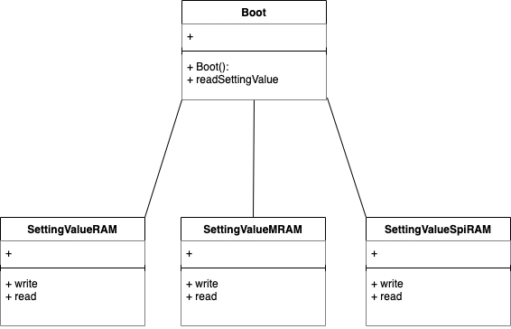

# 【連続講座】ソフトウェア設計原則【SOLID】を学ぶ
#3 依存性逆転の原則（dependency inversion principle）

パーソルクロステクノロジー株式会社
第1技術開発本部　第4設計部　設計2課　阿部耕二

<!--
_class: lead
_paginate: false
_header: ""
footer: ""
-->

# 目次
- 自己紹介
- SOLIDについて
- 依存性逆転の原則（dependency inversion principle）について
- テーマについて
- 原則違反の例
- 原則に則った例
- 依存性注入
- 今回の設計所感
- 設計についてのディスカッション・質問

---
- 参考資料


<!--
_header: ""
_footer: "" 
-->

# 自己紹介
- 名前: 阿部　耕二（あべ　こうじ）
- 所属: パーソルクロステクノロジー株式会社
第1技術開発本部 第4設計部 設計2課
- 医療機器の組込みソフトウェア開発。C言語。
- 趣味: 宇宙開発（リーマンサットプロジェクト広報メンバー）
- LAPRASポートフォリオ: https://lapras.com/public/k-abe
- Twitter: @juraruming

# SOLIDについて
<!--
_footer: "" 
-->
設計の5原則の頭文字をとったもの。

- S 単一責務の原則（Single Respomsibility Principle）
- O オープン・クローズドの原則（Open Closed Principle）
- L リスコフの置換原則（Liskov Substitution Principle）
- I インターフェイス分離の原則（Interface Segregation Principle）
- **D 依存関係逆転の原則（Dependency Inversion Principle）**

## SOLID原則の重要性
<!--
_footer: "" 
-->
> 参考資料2より引用

- 凝集度が高くなる
- 他のモジュールと疎結合になる
- 各モジュールの目的が明確に分けられると、コード変更の際の影響は局所化される。結果、テストしやすい設計になる。

上記の特徴を持つと再利用しやすいコードになる。


# 依存性逆転の原則（dependency inversion principle）について
<!--
_footer: "" 
-->
* 上位レベルのモジュールは下位レベルのモジュールに依存しないようにする。
上位も下位も抽象に依存すべきである。

まず、用語について認識合わせしましょう。
* **上位**とは?
* **下位**とは?
* **抽象**とは?

---
■ **上位レベル・下位レベルのモジュール**とは?

* 上位レベルは**目的**を示す
* 下位レベルは上位の目的を達成する**手段**を実装する

■抽象とは?
* 下位・上位に共通する概念
この後の章のテーマの説明で触れます。

# テーマについて
■テーマ：
仮空の医療モニタ。患者の生体情報をモニタリングできる。
今回は**設定値の書込み・読込み機能**について注目する。

■テーマの要件：
* 画面から装置の設定ができる
* 設定値の例
表示エリア選択、表示テキストの名称・色、画面の輝度、音量、音の種類、センサの校正値（ゲイン・オフセット）、その他いろいろ

---
■テーマの要件（続き）：
* 起動時に前回設定値を装置に反映する。
* 設定値は持ち運べる（装置の設定状態をPCで見れる）

■テーマを実現する要素技術：
●前回設定値の反映
* SRAMの設定値を電池でバックアップ

●設定値の持ち運び
* SDカード書込み・読込み

---
■今後想定される要素技術の変更：
●前回設定値の反映
* （現状）SRAMを電池にてバックアップ
⇒SPI接続のシリアルRAMへ
⇒MRAMでバックアップ電池不要へ

●設定値の持ち運び
* （現状）SDカード書込み・読込み
⇒USBメモリへの変更

---
* 前回設定値の反映
* 設定値の持ち運び
この機能の**抽象概念**は何か?

共通する概念は何か?
⇒**設定値を書く、読むこと**

---
■設定値読み・書きの上位・下位モジュールは?
【下位モジュール】
設定値を書く、読むを実現する**具体的手段**
● 前回設定値の反映
* （現状）SRAMへの書込み・読込み
* SPI接続のシリアルRAMへ
* MRAM

● 設定値の持ち運び
* （現状）SDカードへの書込み・読込み
* USBメモリへの書込み・読込み

---
■設定値読み・書きの上位・下位モジュールは?
【上位モジュール】
抽象：設定値を書く・読むことを利用するモジュール

● 前回設定値の反映
上位モジュールは起動時に抽象を呼び出し、設定値を反映する
上位モジュールは設定値変更をSRAMに書き込む

● 設定値の持ち運び
上位モジュールはSDカード書込みの画面メニューを選択・実行でSDカード書込みを行なう
上位モジュールはSDカード読込みの画面メニューを選択・実行でSDカード読込みを行なう

---

● 前回設定値の反映

上位：Boot
起動時に前回設定値を反映したい

抽象：設定値
設定値の読み・書きの抽象

下位：RAM, MRAM, SpiRAM
実際に設定値を読み・書きする手段を提供する

---
● 設定値の持ち運び


上位：Boot
画面操作されたら設定値の読み・書きをする

抽象：設定値
設定値の読み・書きの抽象

下位：USBMemory, SDCard
実際に設定値を読み・書きする手段を提供する


# 原則違反の例
<!--
_footer: "" 
-->

【前回設定値の反映】機能のクラス図
上位が下位モジュールに依存する場合

---
前ページのクラス図のコード
GitHub URL: [no_dip_principle](https://github.com/grace2riku/solid_principle_example/tree/main/3_dependency_inversion_principle/no_dip_principle)

```cpp:Boot.cpp
// Boot.cpp
#include "Boot.h"

// コンストラクタの実装
Boot::Boot() {
    _settingValue = new SettingValueRam();
}

Boot::~Boot() {
    delete _settingValue;
}

int Boot::readSettingValue() {
    return _settingValue->read();
}
```

---
```cpp:Boot.h
// Boot.h
#ifndef _H_BOOT_
#define _H_BOOT_

#include "SettingValueRam.h"

class Boot {
    private:
        SettingValueRam* _settingValue;

    public:
        Boot();
        ~Boot();
        int readSettingValue();
};

#endif	// _H_BOOT_
```

---
```cpp:SettingValueRam.cpp
// SettingValueRam.cpp
#include "SettingValueRam.h"

// コンストラクタの実装
SettingValueRam::SettingValueRam() {
}

void SettingValueRam::write() {
}

int SettingValueRam::read() {
    return 123;
}
```

---
```cpp:SettingValueRam.h
// SettingValueRam.h
#ifndef _H_SETTINGVALUERAM_
#define _H_SETTINGVALUERAM_

class SettingValueRam {
    private:

    public:
        SettingValueRam();
        void write();
        int read();
};

#endif	// _H_SETTINGVALUERAM_
```

---
```cpp:no_dip_principle.cpp
#include <iostream>
using namespace std;
#include "Boot.h"

int main() {
    Boot* boot = new Boot();

    cout << "SettingValue = " << boot->readSettingValue() << endl;

    delete boot;

    return 0;
}
```

```
実行結果
$ ./no_dip_principle.app 
SettingValue = 123
```

---
原則違反のクラス図・ソースコード

何が課題になるでしょう???

---
課題の一例
* 関心の分離ができていない
目的と目的を達成する手段が混在する。結果、低凝集になる。

目的：起動時に設定値を読む
目的達成手段：RAMに書き込まれている設定値を読む

* 上位モジュールは下位モジュールがないと動かない
組込みソフトウェア開発では下位モジュールがないことの方が多い
（ハードウェアができていない、機材が開発メンバー分がないなどの理由）。
下位モジュールの完成を待っていては開発スケジュールに影響がでる。

---
* コードが汚れる
上位モジュールは下位モジュールがないと動かないから下位モジュールの動作を差し替えるテストコードを用意した、とする。
上位モジュールに本番用コードとテスト用コードを切り替える本番コードには不要な分岐のロジックが実装されソースコードが汚れる。

---
コードが汚れる例 GitHub URL: [no_dip_principle_dirty](https://github.com/grace2riku/solid_principle_example/tree/main/3_dependency_inversion_principle/no_dip_principle_dirty)

```cpp:Boot.cpp
// Boot.cpp
#include "Boot.h"

// コンストラクタの実装
Boot::Boot() {
    if (settingValueSelect) {
        _settingValue = new SettingValueRam();
    } else {
        _settingValueRamFake = new SettingValueRamFake();
    }
}

Boot::~Boot() {
    if (settingValueSelect) {
        delete _settingValue;
    } else {
        delete _settingValueRamFake;
    }
}

int Boot::readSettingValue() {
    if (settingValueSelect) {
        return _settingValue->read();
    } else {
        return _settingValueRamFake->read();
    }
}
```

---
```cpp:Boot.h
// Boot.h
#ifndef _H_BOOT_
#define _H_BOOT_

#include "SettingValueRam.h"
#include "SettingValueRamFake.h"

class Boot {
    private:
        SettingValueRam* _settingValue;
        SettingValueRamFake* _settingValueRamFake;

    public:
        int settingValueSelect = 0;

        Boot();
        ~Boot();
        int readSettingValue();
};

#endif	// _H_BOOT_
```

---
```cpp:SettingValueRamFake.cpp
// SettingValueRamFake.cpp
#include "SettingValueRamFake.h"

// コンストラクタの実装
SettingValueRamFake::SettingValueRamFake() {
}

void SettingValueRamFake::write() {
}

int SettingValueRamFake::read() {
    return 456;
}
```

---
```cpp:SettingValueRamFake.h
// SettingValueRamFake.h
#ifndef _H_SETTINGVALUERAMFAKE_
#define _H_SETTINGVALUERAMFAKE_

class SettingValueRamFake {
    private:

    public:
        SettingValueRamFake();
        void write();
        int read();
};

#endif	// _H_SETTINGVALUERAMFAKE_
```

```
実行結果
$ ./no_dip_principle_dirty.app 
SettingValue = 456
```

---
Boot.cppの実装を見ると下位モジュール(SettingValueRam)か下位モジュールのテストモジュール(SettingValueRamFake)を使うかで分岐が増えている。

この分岐は本番コードには不要なコードである。

上位モジュールが下位モジュールに依存している場合で、下位モジュールをテストしようとするとこんなことがおきる。

コードも汚くなるし、テストしにくい構造になっている。


# 原則に則った例
<!--
_footer: "" 
-->

【前回設定値の反映】機能のクラス図
原則に則り、上位・下位も抽象に依存する場合


# 依存性注入
<!--
_footer: "" 
-->


# 設計についてのディスカッション・質問
<!--
_footer: "" 
-->

- 自分以外の設計の視点が学びになると個人的に考えています。
ぜひぜひお気軽にフィードバックをよろしくお願いします🙇

- こちらに学習の振り返りに使う目的でZennのスクラップを用意しました。
活用ください。

[【SOLID原則】#3 "依存性逆転の原則（dependency inversion principle）"の勉強会後の振り返り](https://zenn.dev/k_abe/scraps/4fe813cb372df3)


# 参考資料
<!--
_footer: "" 
-->
1. [オブジェクト指向習得のための５ステップ【SOLID原則】](https://qiita.com/taktt7/items/af90960f580373f3bb9b)

2. [テスト駆動開発による組み込みプログラミング―C言語とオブジェクト指向で学ぶアジャイルな設計](https://www.oreilly.co.jp/books/9784873116143/)


---

ご清聴ありがとうございました🙇