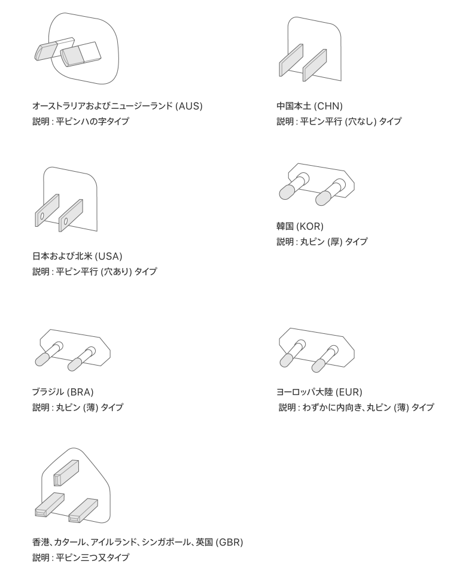

# 【連続講座】ソフトウェア設計原則【SOLID】を学ぶ
#4 開放閉鎖の原則（open/closed principle）

パーソルクロステクノロジー株式会社
第1技術開発本部　第4設計部　設計2課　阿部耕二

<!--
_class: lead
_paginate: false
_header: ""
footer: ""
-->

# 目次
- 自己紹介
- SOLIDについて
- 開放閉鎖の原則（open/closed principle）について
- 日常にある【開放閉鎖】
- 原則違反の例
- 原則に則った例
- 今回の設計所感
- 設計についてのディスカッション・質問
- 参考資料

<!--
_header: ""
_footer: "" 
-->

# 自己紹介
- 名前: 阿部　耕二（あべ　こうじ）
- 所属: パーソルクロステクノロジー株式会社
第1技術開発本部 第4設計部 設計2課
- 医療機器の組込みソフトウェア開発。C言語。
- 趣味: 宇宙開発（[リーマンサットプロジェクト](https://www.rymansat.com/)広報メンバー）
- LAPRASポートフォリオ: https://lapras.com/public/k-abe
- Twitter: @juraruming

# SOLIDについて
<!--
_footer: "" 
-->
設計の5原則の頭文字をとったもの。

- S 単一責務の原則（Single Respomsibility Principle）
- **O オープン・クローズドの原則（Open Closed Principle）**
- L リスコフの置換原則（Liskov Substitution Principle）
- I インターフェイス分離の原則（Interface Segregation Principle）
- D 依存関係逆転の原則（Dependency Inversion Principle）

## SOLID原則の重要性
<!--
_footer: "" 
-->
> 参考資料2より引用

- 凝集度が高くなる
- 他のモジュールと疎結合になる
- 各モジュールの目的が明確に分けられると、コード変更の際の影響は局所化される。結果、テストしやすい設計になる。

上記の特徴を持つと再利用しやすいコードになる。

# 開放閉鎖の原則（open/closed principle）について
<!--
_footer: "" 
-->
* 拡張に開かれており（Open）、変更に閉じられていること（Closed）。

機能拡張（追加）の際にクライアントコード（機能追加したコードを使う側）に変更が発生しないこと。

# 日常にある【開放閉鎖】
<!--
_footer: "" 
-->
生活していると様々な製品・事象で開放閉鎖の原則を感じることができる。

開放閉鎖の原則はソフトウェア設計の領域のみでなく、ビジネスを大きくするための考え方など幅広い事象に転用できる、と個人的に思っている。

いくつか私が日常生活で感じた開放閉鎖の原則について紹介したい。
これらの考え方、事象はより良いソフトウェアの構造にするためのヒントになりそうと感じている。

## 日常にある【開放閉鎖】の例
<!--
_footer: "" 
-->
* USB
* Apple ACアダプタ
* apt-getコマンド
* その他

---
日常にある【開放閉鎖】の例
▪️USB
日常にある【開放閉鎖の原則】の考えたときに一番はじめにイメージしたのがUSB。参考資料3に説明がわかりやすかったので引用する。

参考資料3: [テスト駆動開発による組み込みプログラミング―C言語とオブジェクト指向で学ぶアジャイルな設計](https://www.oreilly.co.jp/books/9784873116143/) 11.1.2 オープン・クローズドの原則（OCP : Open Closed Principle）

> USBポートは規格に準拠したデバイスなら何でも挿せるよう拡張可能だが、新しいデバイスを受け付けるために変更する必要はない。したがってUSBポートのあるコンピュータは、デバイス追加による機能の拡張に対して開いているが、デバイスがUSBに準拠している限り機器構成の変更に対しては閉じていると言える。

---
日常にある【開放閉鎖】の例
▪️Apple ACアダプタ

AppleのACアダプタも開放閉鎖かなと思った。

---
アダプタは取り外し可能で海外でも使えるように考慮されていると予想できる。調べてみたら[Apple ワールドトラベルアダプタキット](https://support.apple.com/ja-jp/HT202114)なる製品があり、7種類のアダプタが付属していた。
プラグ部分が拡張でき、プラグ部分を変更しても本体部分に変更が及ばない作りになっている。

---
日常にある【開放閉鎖】の例
▪️apt-getコマンド
Linux（DebianやUbuntu）のパッケージ追加コマンド。
パッケージを追加してもLinuxカーネル本体には影響がない。
拡張に開かれていて、修正に閉じていると言えそう。

---
日常にある【開放閉鎖】の例
▪️その他
* 家庭のコンセント
* アイフルCM 【そこに愛はあるんか?】のシリーズ
* マクドナルド ハッピーセット リカちゃん

---
▪️家庭のコンセント
コンセント側はコンセントに挿される機器を気にしない。
何がさされても変わらずAC100Vを供給する。
機器側はコンセントから供給されるAC100Vを機器側の仕様に従って利用する。

例）ヘアドライヤーは交流で動作するものが多い印象
例）ACアダプタは交流→直流へ変換し所望の電圧にしている（12V, 5V, 3.3V, その他）

【AC100Vが供給される】ことに従えば様々な機器を動作させることができる。
様々な機器を動作させるためにコンセントの動作に変更は発生しない。

---
▪️アイフルCM 【そこに愛はあるんか?】のシリーズ

---
▪️マクドナルド ハッピーセット リカちゃん

# 原則違反の例
<!--
_footer: "" 
-->

# 原則に則った例
<!--
_footer: "" 
-->

# 今回の設計所感

# 設計についてのディスカッション・質問
<!--
_footer: "" 
-->

- 自分以外の設計の視点が学びになると個人的に考えています。
ぜひぜひお気軽にフィードバックをよろしくお願いします🙇

- こちらに学習の振り返りに使う目的でZennのスクラップを用意しました。
活用ください。

[【SOLID原則】#4 "開放閉鎖の原則（dependency inversion principle）"の勉強会後の振り返り](https://zenn.dev/k_abe/scraps/ede23a2ab89ae6)

# 参考資料
<!--
_footer: "" 
-->
1. [オブジェクト指向の原則１：単一責務の原則とオープンクローズドの原則](https://www.udemy.com/course/objectfive1/)
Udemyの講座。作成者はピーコック アンダーソンさん。オープンクローズドの原則以外のSOLID原則の講座もあり。

2. [オブジェクト指向習得のための５ステップ【SOLID原則】](https://qiita.com/taktt7/items/af90960f580373f3bb9b)

3. [テスト駆動開発による組み込みプログラミング―C言語とオブジェクト指向で学ぶアジャイルな設計](https://www.oreilly.co.jp/books/9784873116143/)

---

ご清聴ありがとうございました🙇