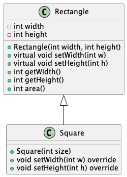

# 【連続講座】ソフトウェア設計原則【SOLID】を学ぶ
#5 リスコフの置換原則（Liskov Substitution Principle）

パーソルクロステクノロジー株式会社
第1技術開発本部　第4設計部　設計2課　阿部耕二

<!--
_class: lead
_paginate: false
_header: ""
footer: ""
-->

# 目次
- 自己紹介
- SOLIDについて
- リスコフの置換原則（Liskov Substitution Principle）について
- 原則違反の例
- 原則に則った例
- 今回の設計所感
- 設計についてのディスカッション・質問
- 参考資料

<!--
_header: ""
_footer: "" 
-->

# 自己紹介
- 名前: 阿部　耕二（あべ　こうじ）
- 所属: パーソルクロステクノロジー株式会社
第1技術開発本部 第4設計部 設計2課
- 医療機器の組込みソフトウェア開発。C言語。
- 趣味: 宇宙開発（[リーマンサットプロジェクト](https://www.rymansat.com/)広報メンバー）
- LAPRASポートフォリオ: https://lapras.com/public/k-abe
- Twitter: @juraruming

# SOLIDについて
<!--
_footer: "" 
-->
設計の5原則の頭文字をとったもの。

- S 単一責務の原則（Single Respomsibility Principle）
- O オープン・クローズドの原則（Open Closed Principle
- **L リスコフの置換原則（Liskov Substitution Principle）**
- I インターフェイス分離の原則（Interface Segregation Principle）
- D 依存関係逆転の原則（Dependency Inversion Principle）

## SOLID原則の重要性
<!--
_footer: "" 
-->
> 参考資料3より引用

- 凝集度が高くなる
- 他のモジュールと疎結合になる
- 各モジュールの目的が明確に分けられると、コード変更の際の影響は局所化される。結果、テストしやすい設計になる。

上記の特徴を持つと再利用しやすいコードになる。


# リスコフの置換原則（Liskov Substitution Principle）について
<!--
_footer: "" 
-->
[出典: wikipedia](https://ja.wikipedia.org/wiki/%E3%83%AA%E3%82%B9%E3%82%B3%E3%83%95%E3%81%AE%E7%BD%AE%E6%8F%9B%E5%8E%9F%E5%89%87)
* サブタイプのオブジェクトはスーパータイプのオブジェクトの仕様に従わなければならない
* 基底型オブジェクトを派生型オブジェクトで型安全に代替できること
※この資料ではつぎの用語の定義とする
スーパータイプ → 基底クラス・スーパークラス, サブタイプ → 派生クラス・サブクラス 

# 原則違反の例
<!--
_footer: "" 
-->
置換できない構造の例
1. サブクラスに実装している
2. 事前条件をサブクラスで強めている
3. 事後条件をサブクラスで弱めている
4. 不変条件をサブクラスで保持していない
5. サブクラスで独自の例外を投げている

---
1. サブクラスに実装している
[長方形と正方形のサンプルコード](https://github.com/grace2riku/solid_principle_example/tree/main/5_liskov_substitution_principle/no_lsp_add_impl_sub_class)を例にして説明する。



---
```cpp:Rectangle.hpp
// Rectangle.hpp
class Rectangle {
protected:
    int width, height;

public:
    Rectangle(const int width, const int height) : width(width), height(height) {}

    virtual void setWidth(const int w);
    virtual void setHeight(const int h);

    int getWidth() const ;
    int getHeight() const ;
    int area() const ;
};
```

---
```cpp:Square.hpp
// Square.hpp
#include "Rectangle.hpp"

class Square : public Rectangle {
public:
    Square(int size) : Rectangle(size, size) {}

    void setWidth(const int w) override;
    void setHeight(const int h) override;
};
```

---
```cpp:Rectangle.cpp
// Rectangle.cpp
#include "Rectangle.hpp"

void Rectangle::setWidth(const int w) {
    width = w;
}

void Rectangle::setHeight(const int h) {
    height = h;
}

int Rectangle::getWidth() const {
    return width;
}

int Rectangle::getHeight() const {
    return height;
}

int Rectangle::area() const {
    return width * height;
}
```

---
```cpp:Square.cpp
// Square.cpp
#include "Rectangle.hpp"
#include "Square.hpp"

void Square::setWidth(const int w) {
    width = height = w;
}

void Square::setHeight(const int h) {
    width = height = h;
}
```

---
```cpp:no_lsp_add_impl_sub_class.cpp
// no_lsp_add_impl_sub_class.cpp
#include <iostream>
using namespace std;
#include "Rectangle.hpp"
#include "Square.hpp"

void process(Rectangle& r) {
    int w = r.getWidth();
    r.setHeight(10);

    std::cout << "expected area = " << (w * 10) << ", got " << r.area() << std::endl;
}

    
int main() {
    Rectangle r(5, 5);
    process(r);  // expected area = 50, got 50

    Square s(5);
    process(s);  // expected area = 50, got 100, LSP violation!

    return 0;
}
```
---

* is-a関係（〜は〜である）が破綻しているため置換できない
❎正方形は長方形である。

長方形は
* 4つの角度が同じ
* 二組の対辺が同じ長さ
という特徴がある。

正方形もこの特徴がある。正方形は前述の特徴に加えてすべての辺が等しいという特徴がある。
正方形も長方形の一種という判断で、この例題では正方形は長方形を継承した。

---
2. 事前条件をサブクラスで強めている

事前条件：メソッドの引数など

基底クラスの定義
```cpp:Parent.hpp
// Parent.hpp
#ifndef PARENT_HPP_
#define PARENT_HPP_

class Parent {
public:
    virtual void doWork(int value);
};

#endif	// PARENT_HPP_
```

---
基底クラスの実装
value < 0 か判定している。
```cpp:Parent.cpp
// Parent.cpp
#include <iostream>
#include "Parent.hpp"
using namespace std;

void Parent::doWork(int value) {
    if (value < 0) {
        throw std::invalid_argument("Parent requires value >= 0");
    }
    // 作業をする
    cout << "Parent value = " << value << endl;
}
```

---
サブクラスの定義
```cpp:Child.hpp
// Child.hpp
#include "Parent.hpp"

class Child : public Parent  {
public:
    void doWork(int value) override;
};
```

---
サブクラスの実装
**value < 10** か判定している。**基底クラスはvalue < 0** の判定だった。
**事前条件を強化（条件が厳しく）** しているため基底クラスとサブクラスが置換不可になっている。

```cpp:Child.cpp
// Child.cpp
#include <iostream>
#include "Child.hpp"
using namespace std;

void Child::doWork(int value) {
    if (value < 10) {
        throw std::invalid_argument("Child requires value >= 10"); // 事前条件を強化している
    }
    // 子クラス固有の作業をする
    cout << "Child value = " << value << endl;
}
```

---
実行結果: 基底クラスと同じ引数をサブクラスに指定した場合

```cpp:ng_preconditions.cpp
// ng_preconditions.cpp
#include <iostream>
using namespace std;
#include "Parent.hpp"
#include "Child.hpp"

int main() {
    Parent parent;
    parent.doWork(0);   // Parent value = 0

    Child child;
    child.doWork(10);   // Child value = 10

    // 例外発生 std::invalid_argument: Child requires value >= 10
    child.doWork(0);

    return 0;
}
```


---
3. 事後条件をサブクラスで弱めている

事後条件：メソッドの戻り値など

基底クラスの定義
```cpp:Parent.hpp
// Parent.hpp
class Parent {
public:
    virtual int getValue();
};
```

---
基底クラスの実装
```cpp:Parent.cpp
// Parent.cpp
#include <iostream>
#include "Parent.hpp"
using namespace std;

int Parent::getValue() {
    // 常に正の値を返す
    return 42;
}
```

---
サブクラスの定義
```cpp:Child.hpp
// Child.hpp
#include "Parent.hpp"

class Child : public Parent  {
public:
    int getValue() override;
};
```

---
サブクラスの実装
```cpp:Child.cpp
// Child.cpp
#include <iostream>
#include "Child.hpp"
using namespace std;

int Child::getValue() {
    int val = Parent::getValue();

    // 事後条件を弱化している（負の値を返す可能性がある）
    return val - 50;
}
```

---
実行結果: サブクラスが負の数を返している（基底クラスは正の数の戻り値を想定している）
```cpp:ng_postconditions.cpp
#include <iostream>
using namespace std;
#include "Parent.hpp"
#include "Child.hpp"
   
int main() {
    int ret_val;
    Parent parent;
    ret_val = parent.getValue();
    cout << "Parent return value = " << ret_val << endl;  // Parent return value = 42

    Child child;
    ret_val = child.getValue();
    cout << "Child return value = " << ret_val << endl; // Child return value = -8

    return 0;
}
```

---
4. 不変条件をサブクラスで保持していない

基底クラスの条件をサブクラスで保持していない、条件を緩めるなどした場合

基底クラスの定義
```cpp:Parent.hpp
// Parent.hpp
class Parent {
protected:
    int value;  // 不変条件: 常に正の数
public:
    Parent(int val) : value(val >= 0 ? val : throw std::invalid_argument("value must be non-negative")) {}
    virtual void setValue(int val);
};
```

---
基底クラスの実装
```cpp:Parent.cpp
// Parent.cpp
#include <iostream>
#include "Parent.hpp"
using namespace std;

void Parent::setValue(int val) {
    if (val < 0) {
        throw std::invalid_argument("value must be non-negative");
    }
    value = val;
    cout << "Parent value = " << value << endl;
}
```

---
サブクラスの定義
```cpp:Child.hpp
// Child.hpp
#include "Parent.hpp"

class Child : public Parent  {
public:
    Child(int val) : Parent(val) {}

    void setValue(int val) override;
};
```

---
サブクラスの実装
```cpp:Child.cpp
#include <iostream>
#include "Child.hpp"
using namespace std;

void Child::setValue(int val) {
    if (val < -10) {    // 親クラスよりも許容範囲を狭めている
        throw std::invalid_argument("Child requires value >= -10");
    }
    // 基底クラスの不変条件「正の数」を破っている
    value = val;

    cout << "Child value = " << value << endl;
}
```

---
実行結果: 基底クラスのメンバ変数は常に正の数というきまりをサブクラスで破っている
```cpp:ng_invaritants.cpp
// ng_invaritants.cpp
#include <iostream>
using namespace std;
#include "Parent.hpp"
#include "Child.hpp"
   
int main() {
    Parent parent(0);
    parent.setValue(1);     // Parent value = 1

    Child child(0);
    child.setValue(-10);    // Child value = -10

    return 0;
}
```

---
5. サブクラスで独自の例外を投げている

基底クラスの定義
```cpp:Parent.hpp
// Parent.hpp
class Parent {
public:
    virtual void doSomething();
};
```

---
基底クラスの実装
```cpp:Parent.cpp
// Parent.cpp
#include <iostream>
#include "Parent.hpp"
using namespace std;

void Parent::doSomething() {
    cout << "Parent -> doSomething() execute." << endl;
}
```

---
サブクラスの定義
```cpp:Child.hpp
// Child.hpp
#include "Parent.hpp"

class Child : public Parent  {
public:
    void doSomething() override;
};
```

---
サブクラスの実装
```cpp:Child.cpp
// Child.cpp
#include <iostream>
#include "Child.hpp"
using namespace std;

void Child::doSomething() {
    throw std::runtime_error("Error occurred"); // 基底クラスが予期しない例外を投げる

    cout << "Child -> doSomething() execute." << endl;
}
```

---
実行結果: 基底クラスは例外を投げないがサブクラスが例外を投げている

```cpp:ng_exception.cpp
// ng_exception.cpp
#include <iostream>
using namespace std;
#include "Parent.hpp"
#include "Child.hpp"
   
int main() {
    Parent parent;
    parent.doSomething();   // Parent -> doSomething() execute.

    Child child;
    child.doSomething();   // 例外発生: std::runtime_error: Error occurred

    return 0;
}
```


# 原則に則った例
<!--
_footer: "" 
-->

つぎの原則違反を改善する。

1. サブクラスに実装している
2. 事前条件をサブクラスで強めている
3. 事後条件をサブクラスで弱めている
4. 不変条件をサブクラスで保持していない
5. サブクラスで独自の例外を投げている

---
1. 【原則違反改善例】サブクラスに実装している

---
2. 【原則違反改善例】事前条件をサブクラスで強めている

---
3. 【原則違反改善例】事後条件をサブクラスで弱めている

---
4. 【原則違反改善例】不変条件をサブクラスで保持していない

---
5. 【原則違反改善例】サブクラスで独自の例外を投げている


# 今回の設計所感


# 設計についてのディスカッション・質問
<!--
_footer: "" 
-->

- 自分以外の設計の視点が学びになると個人的に考えています。
ぜひぜひお気軽にフィードバックをよろしくお願いします🙇

- こちらに学習の振り返りに使う目的でZennのスクラップを用意しました。
活用ください。

[【SOLID原則】#5 "リスコフの置換原則（Liskov Substitution Principle）"の勉強会後の振り返り](https://zenn.dev/k_abe/scraps/f8e47fc7798a07)


# 参考資料
<!--
_footer: "" 
-->
1. [オブジェクト指向の原則２：リスコフの置換原則と継承以外の解決方法](https://www.udemy.com/course/objectfive2/)
Udemyの講座。作成者はピーコック アンダーソンさん。リスコフの置換原則以外のSOLID原則の講座もあり。

2. [オブジェクト指向習得のための５ステップ【SOLID原則】](https://qiita.com/taktt7/items/af90960f580373f3bb9b)

3. [テスト駆動開発による組み込みプログラミング―C言語とオブジェクト指向で学ぶアジャイルな設計](https://www.oreilly.co.jp/books/9784873116143/)


---

ご清聴ありがとうございました🙇